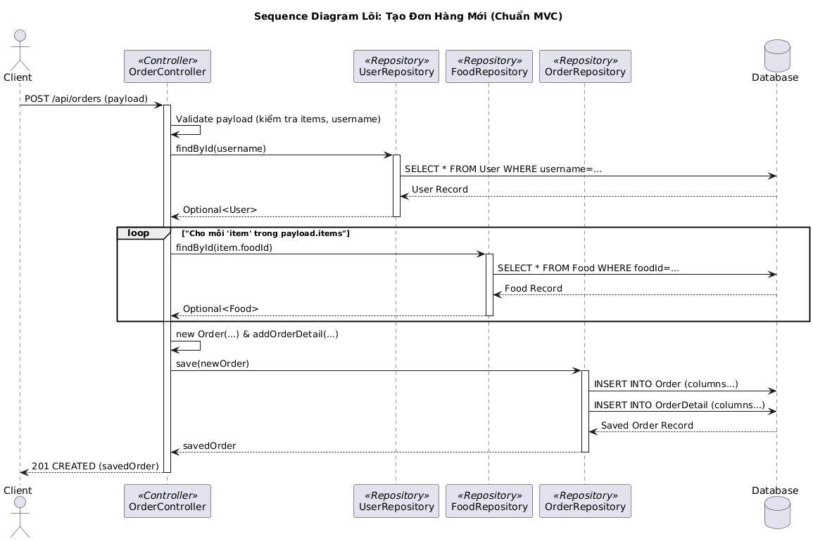

# 🍽️ Ứng dụng Đặt bàn & Gọi món Thông minh — Hưng & Hiếu

## ✅ 1. Giới thiệu tổng quan

Ứng dụng Đặt bàn và Gọi món Thông minh là hệ thống **RESTful API Backend** hỗ trợ toàn bộ nghiệp vụ của một nhà hàng hiện đại: Từ đăng ký tài khoản, đặt bàn, quản lý món ăn, xử lý đơn hàng đến thanh toán và thống kê doanh thu.

**Mục tiêu của dự án:**
- Tự động hóa quy trình hoạt động của nhà hàng 📌  
- Cung cấp API dễ tích hợp cho Web/Mobile Client 📲  
- Đảm bảo bảo mật, dễ mở rộng và hiệu suất cao ⚙️  

Dự án được xây dựng theo **Spring Boot**, áp dụng kiến trúc **3 tầng (Model – Repository – Controller)** với mô hình dữ liệu tiêu chuẩn doanh nghiệp.

---

## 👥 2. Thành viên nhóm

| Họ và tên | Mã số sinh viên | Vai trò |
| :--- | :--- | :--- |
| **Nguyễn Quang Hưng** | 23010103 | Lập trình, xây dựng và triển khai hệ thống |
| **Lều Trung Hiếu** | 23010142 | Phân tích nghiệp vụ, thiết kế CSDL, viết readme |

---

## 🔗 3. Thông tin liên quan

- **GitHub Repository:** "https://github.com/hungquang2005-com/OOP_N03_2526_HIEU_HUNG"

- **Video Demo:** `[Điền link YouTube nếu có]`

### 3.1. Cách chạy chương trình
- vào terminal rồi gõ:

cd demo
mvn spring-boot:run

---

### 3.2 link vào chương trình
- Sau khi chạy lệnh trên vscode ta sẽ vào link của người dùng:
- http://localhost:8082

- Tiếp đến là link của admin:
- http://localhost:8082/admin

## 🚀 4. Chức năng chính của hệ thống

### 🔐 4.1. Quản lý Người dùng & Xác thực (AuthController)
- Đăng ký, đăng nhập, phân quyền người dùng  
- Lấy thông tin tài khoản & danh sách người dùng  

### 🍜 4.2. Quản lý Thực đơn (MenuController)
- CRUD món ăn  
- Lọc & xem chi tiết món  

### 🪑 4.3. Quản lý Bàn ăn (TableController)
- Đặt bàn / Hủy bàn theo trạng thái  
- Quản lý danh sách bàn  

### 🧾 4.4. Quản lý Đơn hàng (OrderController)
- Tạo đơn hàng gồm nhiều món  
- Cập nhật trạng thái (Đang chế biến / Hoàn thành)  
- Lọc đơn theo người dùng  

### 💳 4.5. Thanh toán (PaymentController)
- Ghi nhận giao dịch thanh toán  
- Lưu lịch sử thanh toán  

### 📈 4.6. Báo cáo & Thống kê (StatisticsController)
- Doanh thu theo thời gian  
- Món ăn phổ biến  

---

## 🧩 5. Kiến trúc hệ thống

| Layer | Nhiệm vụ chính |
| :--- | :--- |
| **Controller** | Tiếp nhận request, điều hướng, trả response |
| **Repository** | ORM thao tác trực tiếp với database |
| **Model (Entity)** | Cấu trúc dữ liệu ánh xạ bảng trong DB |

➡️ **Ưu điểm:** Dễ bảo trì – Mở rộng – Tách biệt rõ vai trò từng lớp.

---

## 🖼️ 6. Các sơ đồ thiết kế

### 6.1. Sơ đồ UML (Class Diagram)
**Link ảnh:** [./img/Class_Diagram_Final.png.jpg](./img/uml.jpg)  
> Mô tả các lớp chính: `User`, `Food`, `Order`, `OrderDetail`, `Payment` và mối quan hệ giữa chúng.

---

### 6.2. Link ảnh 4 CRUD theo module (Food, Order, Payment, User)
- **Food CRUD:** [./img/Food.png](./img/food1.jpg)  
- **Order CRUD:** [./img/Order.png](./img/oder1.jpg)  
- **Payment CRUD:** [./img/payment.jpg](./img/payment1.jpg)  
- **User CRUD:** [./img/User.png](./img/user1.jpg)

---

### 6.3. Sơ đồ chức năng tổng thể (Use Case)

---