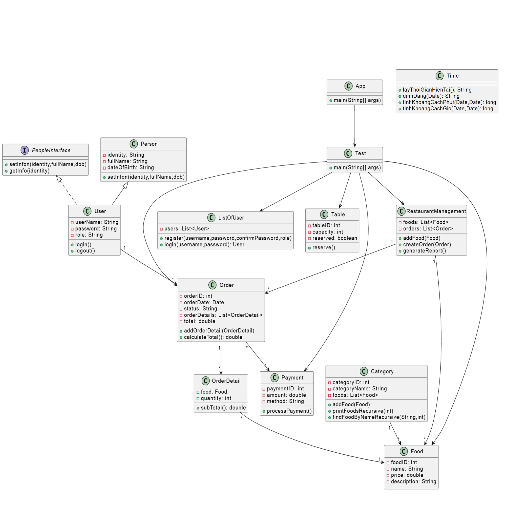
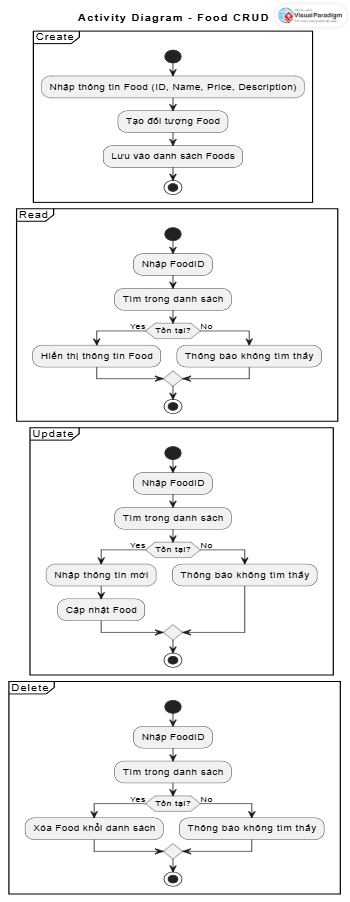
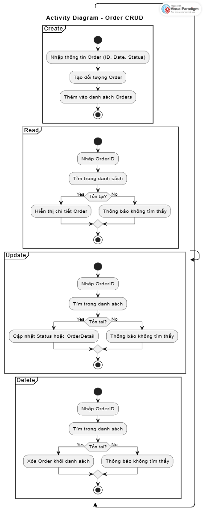
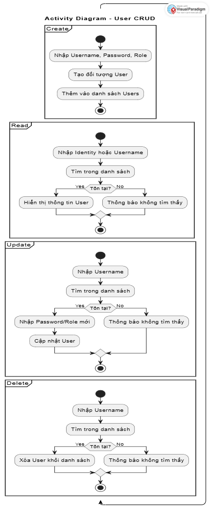

# 🍽️ Restaurant Food Management

## 📌 Giới thiệu
**Restaurant Food Management** là một ứng dụng Java mô phỏng hệ thống quản lý nhà hàng.  
Ứng dụng cho phép:
- Người dùng đăng ký, đăng nhập và quản lý tài khoản.
- Khách đặt bàn, chọn món ăn, gọi món.
- Quản lý theo dõi đơn hàng, tính tổng tiền và thanh toán.

Mục tiêu của dự án:
- Áp dụng **lập trình hướng đối tượng (OOP)** trong Java.
- Thực hành quản lý và thao tác với nhiều **đối tượng thực tế**.
- Thiết kế hệ thống với **Class Diagram** đầy đủ 14 đối tượng.

---

## 🛠️ Chức năng chính
- 👤 **User**: Quản lý tài khoản (đăng ký, đăng nhập, vai trò).  
- 🍜 **Food**: Quản lý menu (thêm, hiển thị, sửa, xóa món ăn).  
- 🧾 **Order**: Quản lý đơn hàng (tạo đơn, thêm món, tính tiền).  
- 💳 **Payment**: Thanh toán với nhiều phương thức (tiền mặt, thẻ, ví điện tử).  
- 🪑 **Table**: Đặt bàn theo sức chứa.  
- 📊 **Report**: Xuất báo cáo đơn hàng và doanh thu.  
- 🕒 **Time**: Hỗ trợ xử lý thời gian (hiện tại, định dạng, tính khoảng cách).  

---

src/
├── App.java # Điểm bắt đầu chương trình
├── Category.java # Quản lý danh mục món ăn
├── Food.java # Món ăn
├── ListOfUser.java # Quản lý danh sách người dùng
├── Order.java # Đơn hàng
├── OrderDetail.java # Chi tiết đơn hàng
├── Payment.java # Thanh toán
├── PeopleInterface.java # Interface mô tả hành vi con người
├── Person.java # Lớp cha cơ bản của User
├── RestaurantManagement.java# Quản lý món ăn + đơn hàng
├── Table.java # Bàn ăn
├── Time.java # Hỗ trợ xử lý thời gian
├── User.java # Người dùng (extends Person)
└── Test.java # Thực thi logic chính (menu console)

## 👤 Danh sách 14 đối tượng
1. **App** – Entry point, chạy chương trình.  
2. **Category** – Nhóm món ăn, chứa danh sách `Food`.  
3. **Food** – Món ăn (ID, tên, giá, mô tả).  
4. **ListOfUser** – Quản lý danh sách người dùng (đăng ký, đăng nhập).  
5. **Order** – Đơn hàng (ID, ngày, danh sách món, tổng tiền).  
6. **OrderDetail** – Chi tiết món ăn trong đơn hàng (Food + số lượng).  
7. **Payment** – Thanh toán (ID, số tiền, phương thức).  
8. **PeopleInterface** – Interface định nghĩa hành vi chung cho người.  
9. **Person** – Lớp cơ sở của `User` (identity, họ tên, ngày sinh).  
10. **User** – Người dùng (username, password, role).  
11. **RestaurantManagement** – Quản lý toàn bộ món ăn và đơn hàng.  
12. **Table** – Quản lý bàn ăn (ID, sức chứa, trạng thái đặt).  
13. **Time** – Hỗ trợ xử lý thời gian (lấy giờ, định dạng, khoảng cách).  
14. **Test** – Thực thi logic chính: đăng nhập, đặt bàn, gọi món, thanh toán.  

---

## 📂 Cấu trúc thư mục

## Sơ đồ diagram

 
## 🛠️ CRUD cho 3 đối tượng

### 1. Food
- **Create**: Nhập thông tin món ăn → Kiểm tra hợp lệ → Tạo mới → Lưu vào danh sách.
- **Read**: Hiển thị danh sách món ăn hoặc tìm theo ID.
- **Update**: Chọn món ăn → Nhập thông tin mới → Cập nhật.
- **Delete**: Chọn món ăn → Xác nhận → Xóa khỏi danh sách.

### 2. Order
- **Create**: Tạo đơn hàng mới → Thêm chi tiết món ăn → Tính tổng tiền.
- **Read**: Hiển thị thông tin đơn hàng theo ID.
- **Update**: Cập nhật trạng thái đơn hàng hoặc chi tiết.
- **Delete**: Xóa đơn hàng khỏi danh sách.

### 3. User
- **Create**: Tạo tài khoản mới (username, password, role).
- **Read**: Xem thông tin user theo Identity hoặc username.
- **Update**: Thay đổi mật khẩu, vai trò, hoặc thông tin cá nhân.
- **Delete**: Xóa user khỏi danh sách.

---

## 🔄 Activity Diagrams

### Food – CRUD

### Order - CRUD

### User – CRUD

